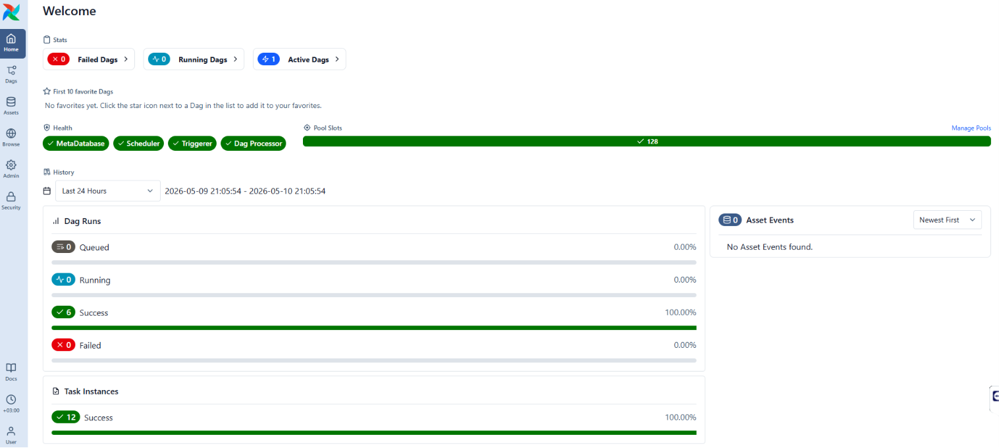
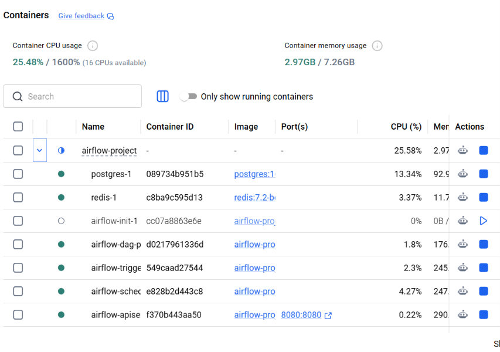
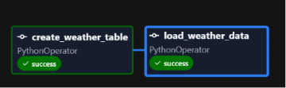
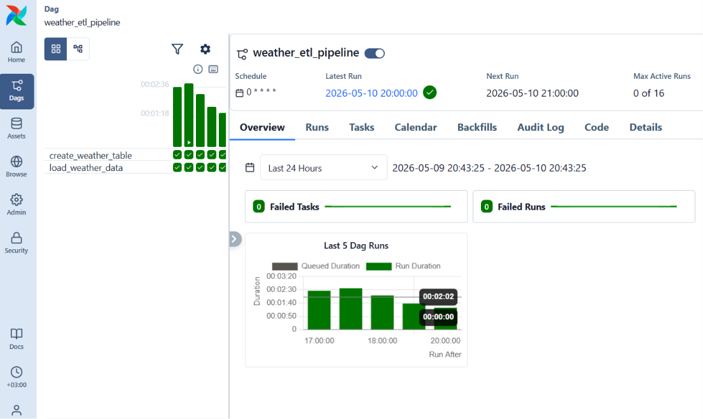
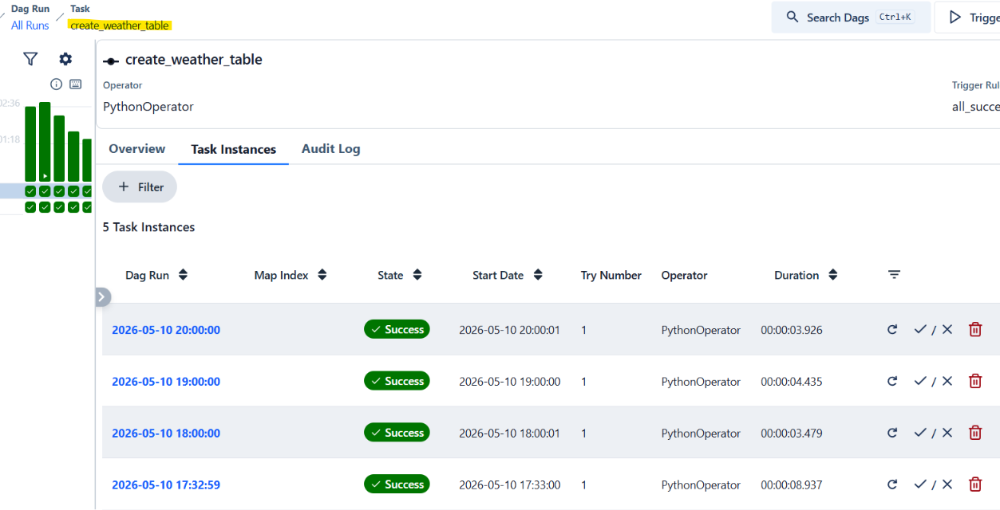
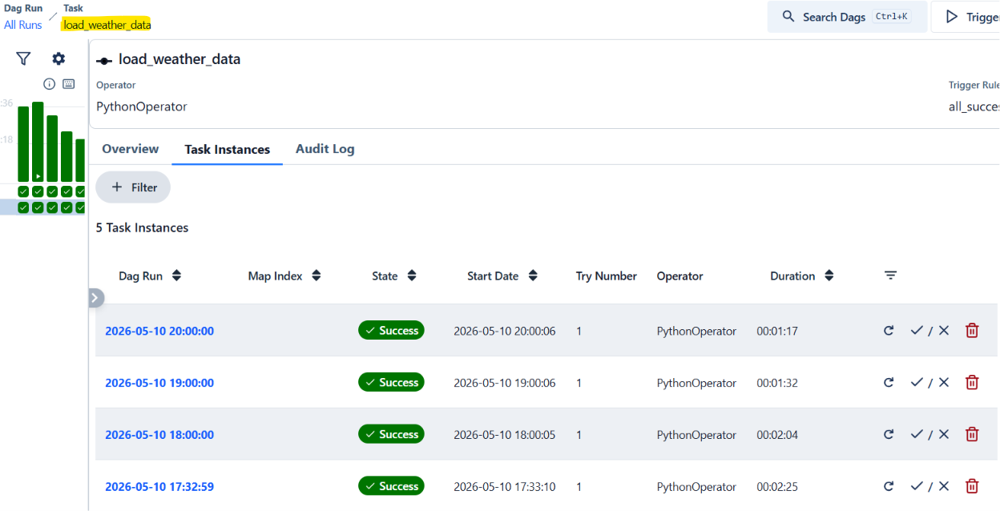
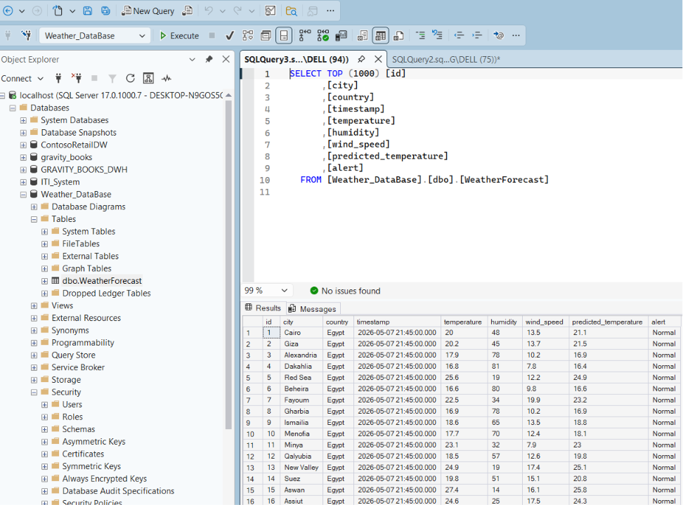
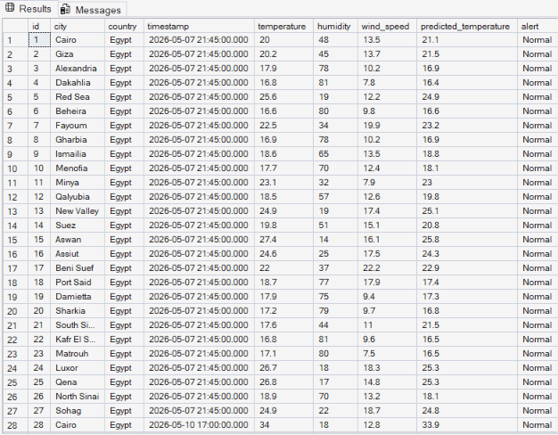

# Weather ETL Pipeline for Egypt Governorates



| Attribute  | Value                                  |
|------------|----------------------------------------|
| Project    | Weather ETL Pipeline                   |
| Version    | 1.0                                    |
| Author     | Mahmoud                                |
| Date       | May 2026                               |
| Status     | Operational                            |

An hourly data pipeline that collects real-time weather observations for all 27 Egyptian
governorates, applies temperature alert classification and linear regression prediction,
then stores the results in Microsoft SQL Server with deduplication.


## Documentation Index

- [architecture.md](docs/architecture.md) - system design, network topology, data flow sequence, volume mounts
- [pipeline.md](docs/pipeline.md) - ETL logic, task breakdown, extract/transform/load phases, deduplication
- [database.md](docs/database.md) - schema, constraints, views, growth estimate, common queries
- [deployment.md](docs/deployment.md) - deployment architecture, environment details, installation, reset, troubleshooting
- [data-source.md](docs/data-source.md) - API reference, request/response format, error handling, coordinates
- [requirements.md](docs/requirements.md) - functional, non-functional, technical, infrastructure, business requirements
- [tech-stack.md](docs/tech-stack.md) - full technology breakdown, version justification, dependency roles
- [development-standards.md](docs/development-standards.md) - coding style, naming conventions, git workflow, DAG structure
- [runbook.md](docs/runbook.md) - operational procedures: restart, rebuild, diagnose, backup, add cities


## Architecture



```
 Open-Meteo API (free, no key required)
        |
        | 27 HTTP requests per run
        v
 +-----------------------------+
 |  Apache Airflow 3.2.0       |
 |  CeleryExecutor on Docker   |
 |                             |
 |  create_weather_table       |
 |         |                   |
 |  load_weather_data          |
 |    extract -> transform     |
 |    -> dedup check -> load   |
 +-----------------------------+
        |
        v
 Microsoft SQL Server
 Database : Weather_DataBase
 Table    : WeatherForecast
```

Airflow infrastructure (PostgreSQL 16, Redis 7.2) runs inside Docker Compose.
The target SQL Server runs on the Windows host and is accessed from containers
via `host.docker.internal`.


## Prerequisites

- Docker Desktop (with WSL2 backend)
- Microsoft SQL Server 2019+ running on the host with:
  - TCP/IP protocol enabled on port 1433
  - SQL Server authentication enabled
  - Database `Weather_DataBase` created
  - Login `sa` with password `Test1234!` (or update the DAG connection string)
- ODBC Driver 17 for SQL Server installed on the host (for standalone testing)


## Project Structure

```
P/
├── airflow-project/
│   ├── dags/
│   │   └── weather_etl_pipeline.py   # Airflow DAG (main pipeline)
│   ├── config/
│   │   └── airflow.cfg               # Airflow runtime configuration
│   ├── docker-compose.yaml           # Container orchestration
│   ├── Dockerfile                     # Custom Airflow image with ODBC driver
│   ├── .env                           # Environment variables (Fernet key, UID)
│   ├── logs/                          # Execution logs (generated at runtime)
│   └── plugins/                       # Custom Airflow plugins (reserved)
├── test_7-5-2026.py                   # Standalone ETL script (runs outside Docker)
├── SQLQuery7-5-2026.sql               # SQL view definition for weather_day
├── requirements.txt                   # Python dependencies (pinned)
├── airflow_backup.zip                 # Backup of Airflow metadata + old logs
└── README.md
```


## Setup

### 1. Prepare SQL Server

Open SQL Server Configuration Manager and ensure TCP/IP is enabled on port 1433,
then restart the SQL Server service. Create the target database:

```sql
CREATE DATABASE Weather_DataBase;
```

The pipeline creates the `WeatherForecast` table automatically on first run.

### 2. Build and Start Airflow

```bash
cd airflow-project
docker-compose build
docker-compose up -d
```

Wait for all containers to report healthy (approximately 2-3 minutes):

```bash
docker ps
```

### 3. Access the Airflow UI

Open http://localhost:8080 in a browser.

Login credentials:
- Username: `airflow`
- Password: `airflow`

Unpause the `weather_etl_pipeline` DAG to start hourly runs.


## DAG: weather_etl_pipeline



| Property    | Value                  |
|-------------|------------------------|
| dag_id      | weather_etl_pipeline   |
| schedule    | @hourly                |
| catchup     | false                  |
| start_date  | 2026-05-07             |
| retries     | 1 (5 min delay)        |

### Task Flow



```
create_weather_table >> load_weather_data
```

**create_weather_table**



Creates the `WeatherForecast` table if it does not exist.

**load_weather_data**



Runs the full ETL cycle internally:
1. Extract: calls Open-Meteo API for each of the 27 governorates
2. Transform: classifies temperature alerts and runs ML prediction
3. Deduplicate: checks existing records by (city, timestamp)
4. Load: inserts only new records into SQL Server


## Data Source

[Open-Meteo API](https://open-meteo.com/) - free weather forecast API, no key required.

Each request fetches current conditions for a single coordinate:
- `temperature_2m` (Celsius)
- `relative_humidity_2m` (percent)
- `wind_speed_10m` (km/h)

API timeout is set to 10 seconds per request. Failed requests for individual cities
are logged and skipped; they do not stop the pipeline.


## Database Schema





```sql
CREATE TABLE WeatherForecast (
    id                    INT IDENTITY(1,1) PRIMARY KEY,
    city                  NVARCHAR(100),
    country               NVARCHAR(100),
    timestamp             DATETIME,
    temperature           FLOAT,
    humidity              FLOAT,
    wind_speed            FLOAT,
    predicted_temperature FLOAT,
    alert                 NVARCHAR(100),
    CONSTRAINT uq_city_timestamp UNIQUE(city, timestamp)
);
```

### Alert Classification

| Condition        | Alert             |
|------------------|-------------------|
| temperature > 36 | High Temperature  |
| temperature < 15 | Low Temperature   |
| otherwise        | Normal            |

### ML Prediction

A `LinearRegression` model (scikit-learn) is trained per batch using humidity and
wind speed as features to predict temperature. The prediction is stored in the
`predicted_temperature` column.


## SQL View

A helper view `weather_day` is available in `SQLQuery7-5-2026.sql`:

```sql
CREATE VIEW weather_day AS
SELECT
    id AS ID,
    city AS City,
    country AS Country,
    [timestamp] AS [Timestamp],
    temperature AS Temperature,
    humidity AS Humidity,
    wind_speed AS [Wind Speed],
    predicted_temperature AS [Predicted Temperature],
    alert AS Alert,
    DATENAME(WEEKDAY, [timestamp]) AS Day
FROM WeatherForecast;
```


## Standalone Testing

The `test_7-5-2026.py` script runs the same ETL logic outside of Docker.
It connects to SQL Server on `localhost` instead of `host.docker.internal`.

```bash
python test_7-5-2026.py
```


## Docker Services

| Service             | Image                  | Purpose              |
|---------------------|------------------------|----------------------|
| postgres            | postgres:16            | Airflow metadata DB  |
| redis               | redis:7.2-bookworm     | Celery broker        |
| airflow-apiserver   | custom (Dockerfile)    | Web UI + REST API    |
| airflow-scheduler   | custom (Dockerfile)    | DAG scheduling       |
| airflow-dag-processor | custom (Dockerfile)  | DAG parsing          |
| airflow-worker      | custom (Dockerfile)    | Task execution       |
| airflow-triggerer   | custom (Dockerfile)    | Trigger management   |

The custom image extends `apache/airflow:3.2.0` with Microsoft ODBC Driver 17,
unixodbc-dev, and Python packages: pandas, requests, sqlalchemy, pyodbc, scikit-learn.


## Environment Variables

Defined in `airflow-project/.env`:

| Variable                    | Description                |
|-----------------------------|----------------------------|
| AIRFLOW_IMAGE_NAME          | Base Docker image          |
| AIRFLOW_UID                 | Container user ID (50000)  |
| AIRFLOW__CORE__FERNET_KEY   | Encryption key for secrets |


## Dependencies

Versions listed are the currently installed versions in the Docker image
(packages are installed unpinned and may update on rebuild).

| Package       | Version | Purpose                      |
|---------------|---------|------------------------------|
| pandas        | 2.3.3   | DataFrame operations         |
| requests      | 2.33.0  | HTTP client                  |
| SQLAlchemy    | 2.0.48  | Database engine              |
| pyodbc        | 5.3.0   | SQL Server ODBC driver       |
| scikit-learn  | 1.8.0   | LinearRegression model       |
| numpy         | 2.4.3   | Numerical computing          |

Full list with pinned minimum versions in `requirements.txt`. See
[tech-stack.md](docs/tech-stack.md) for detailed breakdown.
